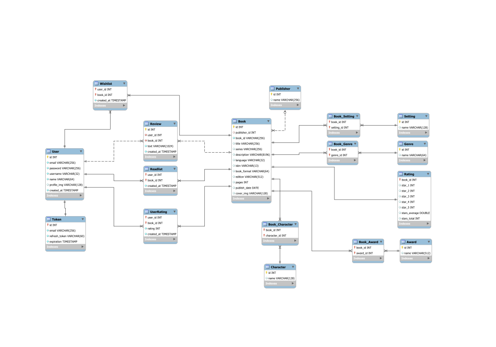

# Stori - Server application (ASP.Net Core Backend)

This is an [ASP.NET Core Web API](https://dotnet.microsoft.com/en-us/apps/aspnet) application built using minimal APIs and Swagger. This project has [Docker](https://www.docker.com/) support and it is the easiest method of setting up and running both the Development and Production environments.

## Getting started

Download, install and start [Docker Desktop](https://www.docker.com/).

After that, bring up the containers for the SQL Server database and the ASP.NET Core Web API server using:

```bash
docker compose --profile dev up -d
```

> Running the server on the development environment automatically sets up a Swagger web interface and apply the database migrations on boot, both features are disabled in production.

To stop the container and delete the allocated resources, run:

```bash
docker compose --profile dev down
```

The server application will be launched in Development mode and the Swagger web interface can be viewed at http://localhost:8081 in your browser.

#### Production environment

In order to run this project in the production environment, the database needs to be populated first by running the migrations manually.

To perform the migrations (Only have to be done once), run the following command:

```bash
docker compose --profile migration up --abort-on-container-exit --exit-code-from stori_db_migration
```

> Running this command will bring up production database and execute the migrations with `dotnet-ef database update`. After the procedure is done, both containers will be stopped.

To clean up the allocated resources for the migration (Only the containers, not the volume where the database data is stored), run:

```bash
docker compose --profile migration down
```

To bring up the containers for the SQL Server database and the ASP.NET Core Web API server, run:

```bash
docker compose --profile prod up -d
```

To stop the container and delete the allocated resources, run:

```bash
docker compose --profile dev down
```

The server application will be launched in Production mode and the web API endpoints can be queried at http://localhost:8081/api/v1 in your browser.

## Environment variables (Database and Server)

This project uses environment variables to configure both the database and the server itself. The variables are set with placeholders values just to make the configuration easier, but they are not meant for production use. If you plan to run this project in a real world scenario, make sure to change them, you have been warned!

### Database

The root database password is set on the `docker-compose.yml` file as `MSSQL_SA_PASSWORD`. If you modify this value, make sure to update the server configuration as well, in order for it to be able to connect.

### Server

The server configuration can be viewed at `src/Server.API/appsettings.json` (Production) and `src/Server.API/appsettings.Development.json` (Development). There are variables for the JWT token config and also the database connection string.

## Testing

Tests can be run manually inside Visual Studio using the Test Explorer tool or you can also run them inside a container. Note that the Integration tests use [TestContainers](https://dotnet.testcontainers.org/) and require Docker in order to run.

To execute both the Integration and Unit tests, also generating a code coverage report, run:

```bash
docker compose --profile test up
```

To clear the allocated resources:

```bash
docker compose --profile test down
```

A folder called `coverage` will be created with the test reports. You can view the results by opening the `coverage/index.html` file in your browser.


## Database ER Model

